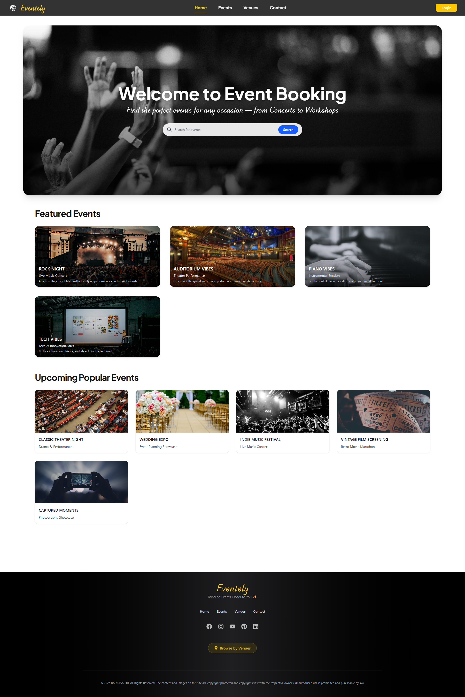
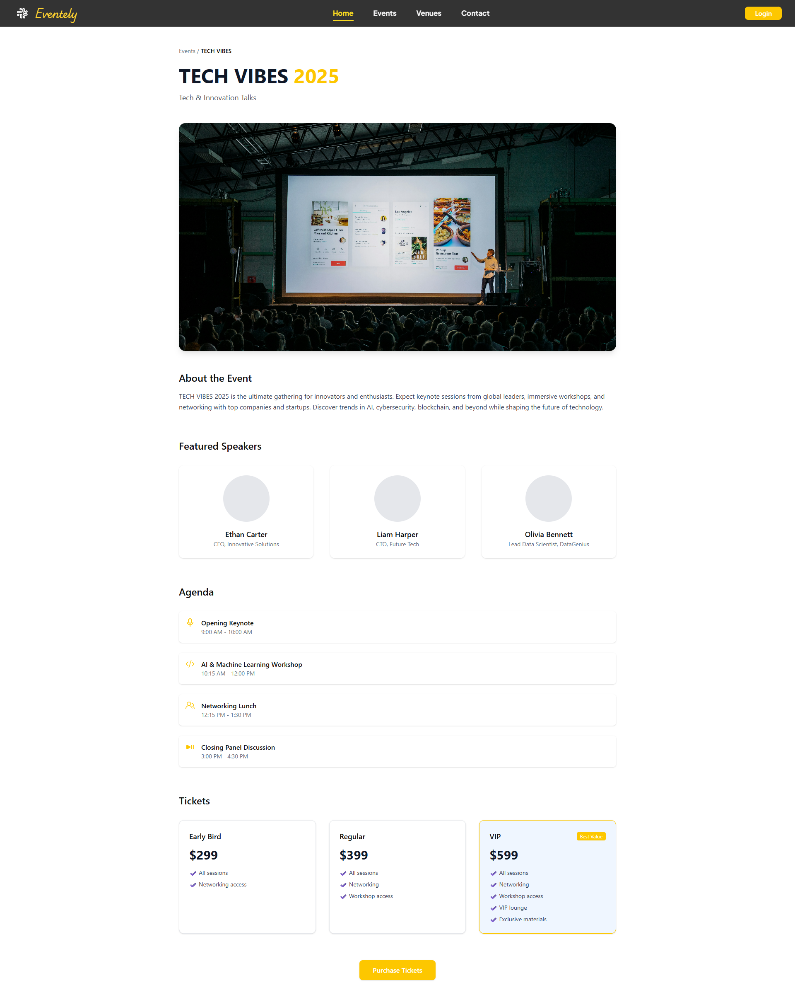
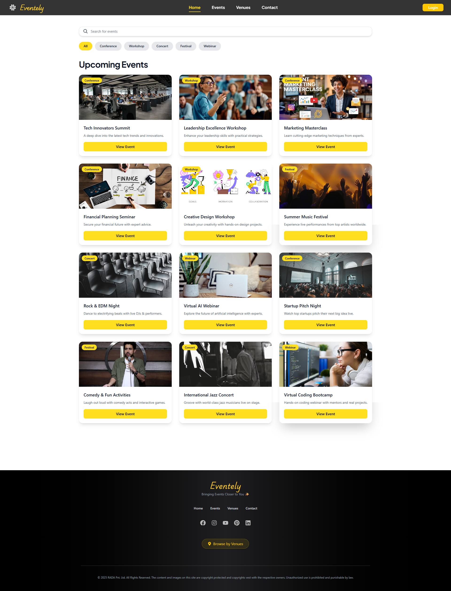

# 🎬 RADAMOVIES - React Movie App

A modern movie streaming web application built with React, Tailwind CSS, and TMDB API (or fake movie data). Inspired by Netflix and designed for a seamless UI experience.

## 🚀 Features

- 🔍 Search movies and TV shows
- 📺 Browse categories like Trending, Top Rated, and Upcoming
- ❤️ Add movies to your personal list
- 🌙 Responsive dark mode UI
- 🧩 Scroll-based navbar animation
- 🎨 Clean design using Tailwind CSS

## 🖼️ Screenshots
Home Page
 

Trending Section 
 

Movies & Description 
 

##🛠️ Tech Stack
Frontend:
- React.js
- Vite
- JavaScript (ES6+)
- CSS / Tailwind (if applicable)
- Backend (Optional / If Used):
- Node.js
- Express.js
- MongoDB

## 📁 Folder Structure
├── src
│ ├── Components
│ ├── assets
│ ├── App.jsx
│ ├── main.jsx
│ └── index.css


## 📦 Installation & Running Locally

```bash
# 1. Clone the repository
git clone https://github.com/your-username/movieverse-app.git
cd movieverse-app

# 2. Install dependencies
npm install

# 3. Run the app
npm run dev 

🤝 Contributing
Pull requests are welcome! For major changes, open an issue first to discuss what you'd like to change.

📄 License
This project is open source and available under the MIT License.
